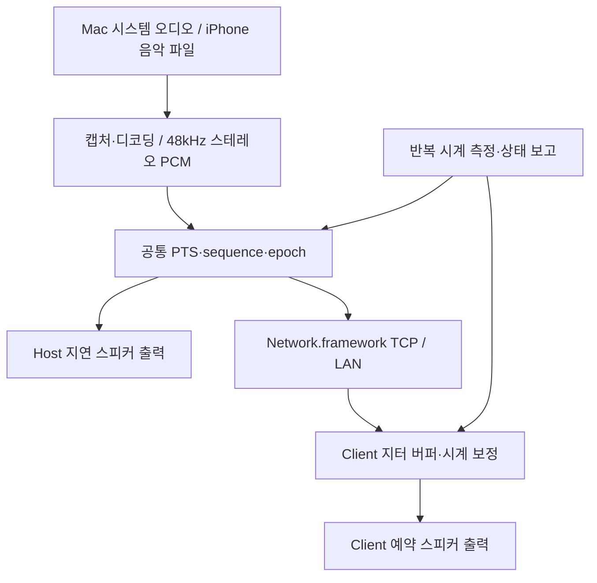

# MusicSync

[English](README.md) | [한국어](README.ko.md)

Mac의 시스템 오디오 또는 iPhone에서 선택한 음악 파일을 같은 LAN의 Mac·iPhone으로 전송하고, 공통 재생 타임라인으로 스피커 출력을 맞추는 Swift/SwiftUI 앱입니다. 두 앱 모두 **호스팅·수신** 탭을 제공하며, 두 기기를 좌우 스피커로 사용하는 스테레오 페어를 지원합니다.

**macOS 26.0 이상 / iOS 26.0 이상**이 필요합니다. iOS 26.7도 배포 대상 범위에 포함됩니다. Apple 기본 프레임워크만 사용하며 인터넷 스트리밍 서버나 가상 오디오 드라이버가 필요하지 않습니다. Xcode 프로젝트가 포함되어 있고 CI에서는 Xcode 26.6으로 빌드합니다.

현재 구현은 실제 네트워크·오디오 파이프라인을 포함합니다. 다만 컴파일 성공이 물리적 스피커의 ±3ms 정밀도를 의미하지는 않습니다. 실제 기기의 오디오 권한, 음향 지연, 장시간 드리프트와 무선 환경을 별도로 검증해야 합니다.

## 라이선스

**[MIT 라이선스](LICENSE)** — Copyright (c) 2026 ACOPS1206.

상업적 이용·수정·재배포가 가능합니다. 사본이나 상당 부분에 저작권 고지와 라이선스를 유지해야 합니다. 비상업적 이용 제한과 파생 프로젝트 소스 공개 의무는 없습니다. 출처 정보는 [NOTICE](NOTICE), 보증과 책임에 관한 전문은 LICENSE를 확인하세요. 현재 버전은 MIT로 배포하며 과거 커밋의 라이선스 고지는 해당 이력에 남아 있습니다.

## 저장소 구성

| 경로 | 내용 |
| --- | --- |
| `MusicSync.xcodeproj` | macOS·iOS 앱 및 iOS WidgetKit 확장 |
| `Shared/MusicSyncCore` | 프로토콜·TCP 전송·시계 동기화·지터 버퍼·동기화 위험 판단과 테스트 |
| `AppShared` | Host/Client 모델·SwiftUI 화면·PCM 출력·파일 디코딩·도움말·실시간 현황 |
| `macOS/MusicSyncMac` | macOS 진입점·CoreAudio 탭·ScreenCaptureKit 캡처 |
| `iOS/MusicSynciOS` | iOS 진입점·음악 보관함 가져오기 |
| `iOS/MusicSyncWidgets` | 잠금 화면·Dynamic Island Live Activity |
| `scripts` | 프로젝트 생성·빌드·오디오 검사·배포 파일 패키징 |
| `.github/workflows/build.yml` | push·PR·수동 실행 시 테스트와 앱 빌드 |

## Mac에서 송신하기

1. 두 기기를 같은 신뢰할 수 있는 Wi-Fi/LAN에 연결하세요. 공유기의 클라이언트 격리를 끄고 필요한 경우 Mac 방화벽에서 MusicSync를 허용하세요.
2. Mac의 출력 장치를 내장 스피커로 선택하고 iPhone도 내장 스피커를 사용하세요.
3. Mac의 **호스팅 → 호스트 시작**을 누릅니다. iPhone의 **수신 → 주변 호스트 찾기**에서 Mac을 선택하고 로컬 네트워크 접근을 허용합니다.
4. 유효한 시계 측정 8회가 모여 동기화될 때까지 기다립니다. **테스트 톤**으로 먼저 두 출력을 비교하세요.
5. 기본 캡처 모드에서 **스트리밍 시작**을 누르고 시스템 오디오 기록 권한을 허용하세요. 일반 브라우저·로컬 음악을 재생하면 소스 앱의 원래 출력은 탭이 동작하는 동안 억제되고 MusicSync가 지연된 소리를 재생합니다.
6. 호스트·클라이언트의 **재생 시점 보정**을 ±30ms 범위에서 조절하세요. 양수는 해당 기기를 더 늦게 재생합니다. 정지는 정상 원래 출력을 복구합니다.

### 캡처 모드의 차이

**동기화 / CoreAudio 탭:** MusicSync 자신의 프로세스를 제외하는 전역 스테레오 프로세스 탭과 비공개 캡처용 aggregate device를 사용합니다. `mutedWhenTapped`로 원래 앱 출력을 억제하고, 현재 Mac 출력 장치에서 동일한 타임라인의 지연 오디오를 재생합니다. 기본 출력 장치를 강제로 바꾸지 않고 가상 드라이버도 설치하지 않습니다.

**모니터 / ScreenCaptureKit:** `capturesAudio`, `excludesCurrentProcessAudio`를 이용해 48kHz 스테레오 시스템 오디오를 전송합니다. 화면 영상은 전송·저장하지 않습니다. 이 API는 원래 Mac 출력을 지연시키지 않으므로 원래 Mac 소리와 iPhone을 정렬할 수 없습니다. 에코를 피하려고 별도의 지연 Mac 복사본을 재생하지 않습니다. 이 모드에서는 스테레오 페어를 선택할 수 없고 동기화 경고가 즉시 표시됩니다.

## iPhone에서 송신하기

1. **호스팅 → 음악 파일 선택**에서 파일 앱/iCloud Drive의 오디오를 선택하거나 **음악 보관함에서 가져오기**를 사용하세요.
2. 선택 파일은 임시 로컬 사본으로 가져옵니다. 전체 곡을 메모리에 올리지 않고 순차 디코딩하여 48kHz 스테레오 Float32 PCM으로 변환합니다.
3. 호스트를 시작한 뒤 다른 iPhone 또는 Mac의 **수신** 탭에서 연결합니다. 시계 동기화가 완료되면 호스트에서 스트리밍을 시작하세요.
4. 시작할 때마다 선택 곡의 처음부터 재생합니다. 일시 정지·탐색·재생목록은 아직 구현하지 않았습니다. 역할을 전환하면 이전 역할을 정지합니다.

음악 보관함 접근에는 **미디어 및 Apple Music** 권한이 필요합니다. 다운로드된 **DRM 없는 곡** 중 AVFoundation으로 읽거나 내보낼 수 있는 항목만 가져옵니다. 보호된 곡과 클라우드에만 있는 곡은 선택 화면에서 숨깁니다. **Apple Music 구독 곡은 다운로드한 경우에도 MusicSync PCM 스트림으로 가져오지 않습니다.** Apple Music 카탈로그 송신이나 DRM 우회 기능이 아닙니다. iPhone에서 다른 앱의 시스템 오디오를 캡처하는 기능도 없습니다.

## 두 기기를 스테레오 스피커로 사용하기

스트리밍 전에 **스피커 배치**를 `호스트 왼쪽 · 클라이언트 오른쪽` 또는 그 반대로 선택하세요. 각 기기를 지정한 쪽에 놓고 클라이언트를 `호스트 설정 따르기`로 두면 자동 배정됩니다. 왼쪽 기기는 원본 왼쪽 채널을 자체 스피커 채널들에, 오른쪽 기기는 원본 오른쪽 채널을 재생합니다. 전송 데이터에는 항상 양쪽 채널이 남아 있습니다.

클라이언트가 여러 대라면 각 기기의 출력 채널을 직접 설정할 수 있습니다. 모노 음원은 실제 스테레오 공간감을 만들 수 없습니다. 페어 모드의 테스트 톤은 매초 공통 동기화 펄스, 낮은 왼쪽 전용 펄스, 높은 오른쪽 전용 펄스 순서입니다. 물리적 간격·방향·스피커 특성이 결과에 영향을 주며 AirPlay/HomePod 페어링을 구현한 것은 아닙니다.

## 실시간 현황과 동기화 경고

앱 안의 현황은 **초당 2회** 갱신하며 세션 상태, PCM 패킷/초, PCM 대역폭, 패킷 수, 최근·누적 누락, 예약 재생 오차 추정과 갱신 시각을 표시합니다. 수신 화면에서는 지터 버퍼의 패킷 수와 예약된 오디오 길이도 볼 수 있습니다. PCM 대역폭은 단일 스트림의 payload 기준으로 JSON/base64/TCP 부가 데이터나 여러 클라이언트 합계를 포함하지 않습니다.

경고 기준은 다음과 같습니다.

| 관측값 | 경고 기준 |
| --- | --- |
| 시계 불확실성 `RTT/2 + jitter` | 60ms 초과가 5초간 지속 |
| 예약 시점 대비 큐 타임라인 오차·지각 | 25ms 초과가 3초간 지속 |
| 최근 오디오 패킷 누락 | 초당 10개 초과가 3초간 지속 |
| 마지막 시계 갱신 | 5초 초과 상태가 3초간 지속 |
| 스트리밍 중 마지막 오디오 | 2초 초과 상태가 3초간 지속 |
| ScreenCaptureKit 모니터 모드 | 즉시 경고 |

각 위험을 독립적으로 0.5초마다 검사하며 시계 불확실성은 **5초**, 다른 위험은 **3초** 지속되어야 표시합니다. 각각의 회복 기준(45ms, 15ms, 초당 5개, 3초, 1초) 이하에서 **3초간 안정**되면 해제합니다. 검사 공백은 지속 시간에 포함하지 않습니다. 서로 다른 일시적 위험을 합산하여 경고하지 않습니다. 클라이언트는 경고와 누락 정보를 Host에도 보고합니다. clock offset은 기기의 부팅 후 경과 시간이 다르면 커질 수 있으므로 절대 크기 자체로 경고하지 않습니다.

**이 경고는 동기화 위험 추정이며 실제 스피커 간 음향 오차를 측정한 결과가 아닙니다.** 경고가 없더라도 출력 장치의 지연 보고 오차나 음향 거리가 남을 수 있습니다. Wi-Fi를 확인하고 Bluetooth/AirPlay 대신 내장 스피커에서 테스트 톤과 수동 보정을 사용하세요.

## 잠금 화면·Dynamic Island

iOS에서 **잠금 화면과 Dynamic Island에 세션 표시**를 켜고, MusicSync를 연 상태에서 연결하거나 호스트를 시작하세요. ActivityKit이 세션을 시작·갱신·종료하고 포함된 `MusicSyncWidgets.appex`가 잠금 화면, Dynamic Island의 최소·축소·확장 화면을 렌더링합니다. 역할, 세션 상태, 버퍼 지연, RTT, 시계 불확실성, 기기 수·누락·경고가 해당 레이아웃에 표시됩니다.

앱은 일반 수치 갱신을 약 **5초 간격**, 상태·경고 변화를 최소 **1초 간격**으로 요청합니다. 수치가 같아도 heartbeat로 갱신합니다. 15초 뒤 stale 상태가 되도록 설정하지만 실제 화면 갱신·표시 시점은 iOS가 결정합니다. 세션 정지·연결 해제·토글 해제로 종료하며, 사용자가 닫은 현황은 같은 세션에서 다시 띄우지 않습니다. 다시 표시하려면 세션을 새로 시작하세요. 이 기능은 백그라운드 실행 권한을 추가로 부여하지 않고 푸시 서버도 사용하지 않습니다.

**LiveContainer에서 게스트 WidgetKit 확장이 등록되는 것은 보장되지 않습니다.** 확장 등록이 안 되면 앱 내부 현황은 작동해도 Live Activity·Dynamic Island는 표시되지 않을 수 있습니다. 일반 서명 설치를 권장하며 IPA의 `PlugIns/MusicSyncWidgets.appex`를 보존하고 앱·확장 모두 적절한 번들 ID와 프로비저닝으로 서명하세요. 확장 번들 ID는 앱 ID의 접두어를 유지해야 합니다. 서명 도구가 확장을 제거하면 이 기능은 사용할 수 없습니다. Dynamic Island가 없는 기기는 잠금 화면을 이용합니다.

## LiveContainer 자동 검색 오류

LiveContainer는 게스트를 자신의 프로세스에서 실행하므로 iOS가 게스트가 아닌 컨테이너의 Bonjour 서비스 목록을 검사할 수 있습니다. `_musicsync._tcp`가 허용되지 않으면 권한 요청 전에 `NoAuth (-65555)`가 발생할 수 있습니다. iOS 26.7 자체가 앱을 실행할 수 없다는 뜻은 아닙니다.

- 컨테이너의 로컬 네트워크 권한을 허용하세요.
- Mac Host에서 **연결 주소 복사**를 눌러 실제 `MacName.local:port`를 수신 기기의 직접 연결에 입력하세요. 예시 placeholder는 실제 주소가 아닙니다.
- iPhone Host의 Bonjour 광고가 차단되면 시작 전에 **직접 연결만 사용 (LiveContainer)**을 켜세요. 서비스 등록 없이 TCP로 호스팅하고 Wi-Fi IPv4 주소와 포트를 표시합니다.
- 주소·포트는 재시작이나 네트워크 변경 때 바뀔 수 있습니다. `.local` 해석을 차단하는 LAN에서는 Mac 호스트 이름을 찾을 수 없을 수 있습니다.
- 컨테이너의 음악 보관함·백그라운드·확장 권한은 게스트 설정만으로 해결되지 않을 수 있습니다.

직접 연결도 동일한 clock sync와 오디오 프로토콜을 사용하며 로컬 네트워크 권한이 필요합니다. 자동 재연결은 선택한 호스트에 적용되고 명시적인 연결 해제는 재시도를 끕니다. 참고: https://github.com/LiveContainer/LiveContainer/issues/1519

## 동기화 원리

각 기기는 wall clock 대신 `mach_absolute_time()`과 timebase로 변환한 monotonic 시간을 사용합니다. Client 송신 `t1`, Host 수신 `t2`와 회신 `t3`, Client 수신 `t4`로 다음을 계산합니다.

- `RTT = (t4 − t1) − (t3 − t2)`
- `offset = ((t2 − t1) + (t3 − t4)) / 2` — Host 시계에서 Client 시계를 뺀 값
- 최근 32개 유효 샘플 중 RTT가 작은 8개를 평균하고 시작 이후 offset을 완만하게 보정합니다. 초기 빠른 측정 뒤 매초 재측정합니다.
- RTT 변화로 jitter를 추정합니다. `RTT/2 + jitter`는 네트워크 기반 불확실성 추정치로 실제 음향 오차가 아닙니다.

Host는 약 **180ms** 뒤의 샘플 수 기반 공통 presentation timeline을 만들고 sequence·epoch·PTS를 붙입니다. Client는 `localPTS = hostPTS − offset`으로 변환합니다. 각 기기는 자신의 출력 지연을 보정하여 `AVAudioPlayerNode`에 host time으로 예약합니다. 중복·늦은·잘못된 패킷은 버리고 큐 크기를 제한합니다. 초기 clock 보정이 2ms 이내면 연속 버퍼를 이어 붙여 짧은 끊김을 줄입니다.

Client의 RTT·jitter·출력 지연·누락 상황에 따라 Host가 **공통 지연을 180–500ms** 안에서 늘립니다. 스트리밍 도중 줄이지 않으며 재시작하면 기본값으로 돌아갑니다. 여러 수신 기기 중 가장 큰 지연 요구를 따릅니다. 지연 증가나 정체 복구 시 짧은 공백이 생길 수 있습니다.

좋은 LAN에서 **180–250ms 정도**를 목표로 설계했지만 측정된 기기 성능값은 아닙니다. 출력 지연 추정, Wi-Fi 비대칭, 거리(약 1m당 3ms), 오디오 하드웨어 드리프트가 상대 오차에 영향을 줍니다. 연속 resampling/PLL은 아직 없으며 장시간 재생에서 작은 공백·겹침이 남을 수 있습니다.



## 네트워크 프로토콜

Bonjour `_musicsync._tcp` 서비스에 TCP로 연결합니다. 각 메시지는 4바이트 big-endian 길이와 Codable UTF-8 JSON이며 최대 128KiB입니다. PCM은 JSON base64로 담습니다. 메시지 종류는 `hello`, `ping`, `pong`, `stats`, `timeline`, `audio`, `stop`입니다.

오디오에는 sequence·epoch·PTS·48kHz sample rate·2 channels·frame count·latency·payload가 포함됩니다. payload는 interleaved little-endian Float32 스테레오이며 보통 480 frames/10ms입니다. 선택적 `outputChannel`은 재생 채널을 지정하고, `monitor`는 원래 Mac 출력이 동기화되지 않는 모드를 나타냅니다. stats의 선택적 경고·누락·스케줄 오차·버퍼 수 필드는 Host 상태 표시용입니다. 이전 peer는 새 선택 필드를 무시할 수 있습니다.

Raw PCM은 수신 기기당 3.072Mbit/s, JSON/base64 부가 데이터 포함 약 4.3Mbit/s입니다. TCP 손실 복구 때문에 지연이 증가할 수 있으며 전송 대기열은 512KiB로 제한합니다. **암호화·인증이 없어 신뢰하는 LAN에서만 사용하세요.** 호스트 활성화 중에는 LAN 연결을 수락합니다. TLS/인증 페어링·UDP/QUIC는 향후 작업입니다.

## 권한

- 두 앱: `NSLocalNetworkUsageDescription`, `NSBonjourServices`.
- Mac: 시스템 오디오 기록 권한. 모니터 모드는 화면 및 시스템 오디오 기록 권한. 설정 → 개인정보 보호 및 보안에서 허용 후 재실행이 필요할 수 있습니다.
- iPhone: 선택적으로 미디어 및 Apple Music 보관함 권한. 파일 가져오기는 사용자가 선택한 security-scoped 파일에 접근합니다.
- iOS: playback AVAudioSession과 audio background mode. Live Activity에는 `NSSupportsLiveActivities`와 포함된 WidgetKit 확장을 구성합니다. 사용 가능 여부는 ActivityAuthorizationInfo로 확인합니다.

마이크를 녹음하지 않아 마이크 권한은 요청하지 않습니다. CoreAudio 탭 검증을 위해 Mac 앱의 App Sandbox는 사용하지 않습니다. CI에는 개발자 인증서가 없으며 실제 설치 시 서명 도구/Xcode가 프로비저닝 조건을 충족해야 합니다. 백그라운드 오디오가 재생을 허용하더라도 앱 중단·네트워크 변경·sleep 후 자동 복구를 보장하지 않습니다.

## 빌드

Xcode 26 이상에서 `MusicSync.xcodeproj`를 열고 `MusicSyncMac` 또는 `MusicSynciOS` scheme을 선택하세요. iOS scheme이 WidgetKit 확장도 빌드하고 앱에 포함합니다. iPhone 직접 설치에는 signing team과 앱·확장의 호환되는 bundle identifier를 설정해야 합니다.

```sh
swift test --package-path Shared/MusicSyncCore
bash scripts/test_audio.sh
bash scripts/build.sh
```

`python3 scripts/generate_project.py`는 외부 생성 도구 없이 프로젝트와 Info.plist를 재생성합니다. 파일 추가나 설정 변경 시 생성기를 수정한 뒤 실행하고 결과를 커밋하세요. CI는 생성 결과가 커밋과 같은지도 검사합니다.

## Actions 배포 파일

GitHub → **Actions → Build MusicSync → 성공한 실행 → Artifacts**에서 받습니다.

| Artifact | 내용 |
| --- | --- |
| `MusicSync-iOS` | unsigned `MusicSync-iOS.ipa`, `MusicSync-iOS.app.zip` |
| `MusicSync-macOS` | `MusicSync-macOS.zip` — arm64/x86_64 universal 앱 |
| `MusicSync-build-logs` | 빌드 로그 |

CI는 macos-26/Xcode 26.6에서 테스트·실제 파일 디코딩·양쪽 앱 빌드를 수행합니다. `CODE_SIGNING_ALLOWED=NO`, `CODE_SIGNING_REQUIRED=NO`로 컴파일하고 iOS IPA는 `Payload/MusicSync.app` 구조로 패키징합니다. **unsigned IPA는 일반 iPhone에 그대로 설치할 수 없습니다.** 적절한 사이드로딩 도구로 앱과 확장을 함께 서명하거나 Xcode에서 다시 빌드하세요.

Mac은 개발자 인증서 없이 ad-hoc 서명을 적용·검증합니다. Developer ID 서명이나 공증이 아니므로 macOS의 명시적인 열기/허용이 필요할 수 있습니다. CI는 실제 캡처 권한이나 스피커를 테스트하지 않습니다. 패키징 시 executable·최소 OS·언어 리소스·LICENSE/NOTICE·IPA 구조·WidgetKit 확장과 bundle ID/버전을 확인합니다.

## 알려진 제한

- DRM 또는 macOS 보안 정책으로 보호된 오디오는 무음이거나 캡처 불가일 수 있습니다. 일반 브라우저와 DRM 없는 로컬 파일부터 시험하세요.
- 실제 스피커 간 ±3ms 또는 sample-accurate 음향 정렬을 보장하지 않습니다. 경고도 위험 추정치입니다.
- 호스트의 지연 출력 때문에 동영상 화면과 소리에 차이가 생깁니다. 음악 재생을 우선합니다.
- 파일 재생 탐색·재생목록, 지속적 하드웨어 드리프트 resampling, 인증 페어링, 손실 은폐, 매끄러운 sleep 복구는 미구현입니다.
- UI/main runloop 정체, Wi-Fi 혼잡, VPN·방화벽·클라이언트 격리, Bluetooth/AirPlay가 오디오와 상태 갱신을 방해할 수 있습니다.
- Live Activity는 iOS가 표시·갱신을 관리하며 앱이 중단되면 상태가 오래될 수 있습니다. 실제 서명 설치, Dynamic Island와 LiveContainer 동작은 실기기 검증이 필요합니다.
- LiveContainer의 자동 검색·음악 권한·백그라운드 재생·확장 등록은 컨테이너 자체의 설정에 영향을 받습니다.

### 자세한 현황 (v0.4.1)

동기화 경고에 현재 수치, 기준값, 가능한 이유와 RTT/2 + jitter 계산을 표시합니다. 경고 해제까지 3초간 안정되어야 하므로 수치는 이미 회복 중일 수 있습니다. 호스트가 전달받은 경고는 클라이언트 보고임을 표시하며 상세 진단은 해당 클라이언트에서 확인합니다. 앱의 실시간 현황 하단에 지연 및 동기화의 모든 항목을 작은 글씨로 표시합니다. 잠금 화면과 확장 Dynamic Island에는 “MusicSync 스트리밍 중”처럼 제목과 상태를 합치고 버퍼, RTT, 오프셋, jitter, 불확실성 및 누락을 작은 글씨로 모읍니다. 호스트 시계 수치는 불확실성이 가장 큰 같은 클라이언트를 기준으로 하며 호스트 누락은 로컬 재생 기준입니다. 도움말에서 시스템/영어/한국어 앱 언어를 선택할 수 있고 두 메인 화면에 GitHub 링크를 추가했습니다. 위젯 언어는 시스템 앱 언어를 따릅니다.
