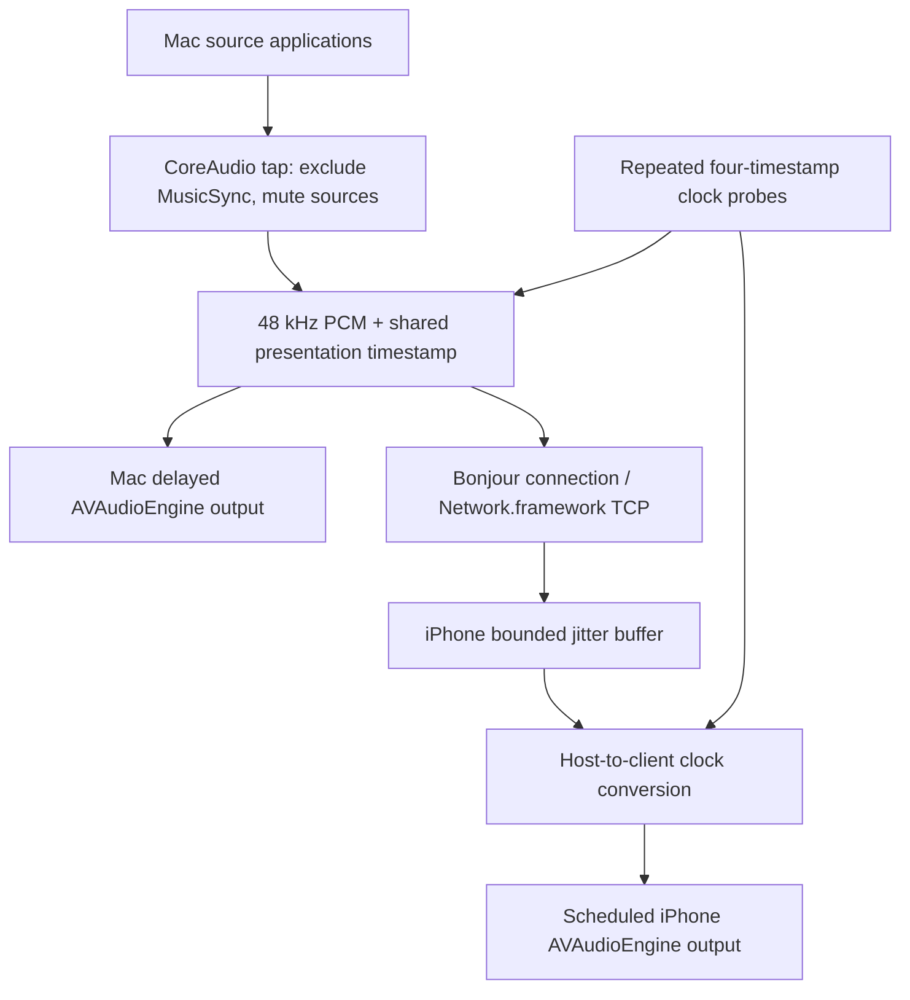

# MusicSync

MusicSync streams Mac system audio or music files hosted on iPhone to nearby Macs and iPhones, scheduling all speakers against one presentation timeline. Each app has Host and Listen tabs, with optional left/right stereo pairing. Swift / SwiftUI, Apple frameworks only, no cloud, no audio driver installation. Requires **macOS 26.0+ and iOS 26.0+**. The committed Xcode project opens directly; CI builds with Xcode 26.6 to catch accidental newer API use.

This is a functional first implementation, not a claim of measured ±3 ms acoustic synchronization. Compilation and protocol tests can be automated; permissions, process muting, physical speaker latency and long-run clock drift must also be tested on real devices.

[English](README.md) | [한국어](README.ko.md)

## License

[MIT](LICENSE), copyright (c) 2026 ACOPS1206. Commercial use, modification and redistribution are permitted; retain the copyright notice and license in copies or substantial portions. There is no noncommercial or derivative-source-disclosure requirement. See [NOTICE](NOTICE) for attribution and the full license for warranty terms. This revision is released under MIT; historical commits retain their original license notices.

## Repository

- `MusicSync.xcodeproj`: shared `MusicSyncMac` and `MusicSynciOS` schemes.
- `Shared/MusicSyncCore`: local Swift package; versioned framing, Network.framework peer transport, monotonic clock estimation, adaptive delay, bounded jitter queue and XCTest tests (including real loopback TCP ping/PCM transport).
- `macOS/MusicSyncMac`: Mac entry point, CoreAudio process tap and ScreenCaptureKit alternative.
- `iOS/MusicSynciOS`: iPhone entry point and native music library picker / import.
- `iOS/MusicSyncWidgets`: WidgetKit Live Activity and Dynamic Island layouts.
- `AppShared`: shared Host and Client models/views, Bonjour browsing, file decoder, stereo assignment, reconnection, scheduled AVAudioEngine output and bilingual Help.
- `scripts`: reproducible project generator, builds, artifact validation and packaging.
- `.github/workflows/build.yml`: tests and both application builds on push, PR and workflow_dispatch.

## v0.4 — MIT, sync warnings and Live Activities

This revision is MIT licensed, with an equivalent [Korean README](README.ko.md). Both apps show a real-time dashboard refreshed twice/second: session phase, PCM packet rate/bandwidth (one payload stream, excluding framing), totals, recent drops, scheduling error estimate and update time. The receiver also shows queued packets and scheduled audio duration.

Sync warnings observe clock uncertainty above 60 ms for 5 seconds. Scheduling error/lateness above 25 ms, recent drops above 10 packets/s, clock information older than 5 seconds or streaming audio older than 2 seconds must persist for 3 seconds. Each issue has an independent timer. Warnings clear after 3 seconds below their lower recovery thresholds (45 ms, 15 ms, 5 packets/s, 3 seconds and 1 second respectively). Missing observations do not count as sustained risk. ScreenCaptureKit monitor mode warns immediately. Client warnings are reported to the Host. **This is risk estimation, not measurement of acoustic speaker alignment**; clock offset magnitude alone is not considered an error.

The iOS app includes a real embedded `MusicSyncWidgets.appex` WidgetKit extension. ActivityKit starts/updates/ends a Live Activity for Host or Listen; Lock Screen and minimal/compact/expanded Dynamic Island layouts display session state, buffer, RTT, clock uncertainty, device count and warnings as space permits. Enable the toggle and start the session while the app is foreground. Local updates are throttled to about five seconds for metrics, at least one second for significant state changes; iOS decides actual presentation timing. A heartbeat refreshes unchanged state and content has a 15-second stale date. Stop/disconnect or disabling the toggle ends it; a dismissed activity stays dismissed until a new session. No push server is used. A Live Activity does not grant extra background execution.

**LiveContainer may not register guest widget extensions**, so the Live Activity/Dynamic Island cannot be guaranteed there. In-app metrics still work. For normal installation preserve `PlugIns/MusicSyncWidgets.appex` and re-sign/provision both app and extension with compatible bundle identifiers. Devices without Dynamic Island use the Lock Screen. CI validates extension embedding and IPA layout; physical signed-device/LiveContainer presentation needs testing.

## iPhone hosting and stereo pair (v0.3)

1. On iPhone open **Host**, then **Choose Music File** (Files / iCloud Drive) or **Import from Music Library**. Import creates a temporary local copy; one song is decoded incrementally, converted to 48 kHz stereo PCM and sent through the same clock/timestamp pipeline as Mac capture. Each Start Streaming restarts the file; pause, seeking and playlists are not implemented yet.
2. Library access requires Media & Apple Music permission. Only downloaded **DRM-free** library items with an accessible asset URL can be exported with AVFoundation. The picker hides protected and cloud-only songs. **Apple Music subscription streams/downloads cannot be captured or converted to transferable PCM.** This feature imports compatible music from the system Music library; it does not stream the Apple Music catalog or bypass DRM. Unsupported selections show an explanation. MusicKit playback does not expose a transferable decoded PCM source for this pipeline.
3. Start Host, then connect from **Listen** on another iPhone **or Mac**. Wait for clock sync, then Start Streaming. Role changes stop the previous role to avoid simultaneous competing audio engines. Mac system capture still requires Mac Host; iPhone Host only sends the selected music file or test tone, never another app's system audio.
4. For a stereo pair choose **Host left · Client right** or the reverse before streaming. The Host plays one original channel through both of its physical speaker channels; the Client plays the opposite channel. **Follow Host** is the default client assignment. Multiple Clients get the same remote assignment unless their own channel picker or the Host’s per-device picker overrides it. Mono sources remain mono. In pair mode Test Tone plays a common alignment pulse, followed by a lower left-only pulse and a higher right-only pulse each second. Physical spacing, orientation and unequal speaker response affect the stereo image; this is not AirPlay/HomePod pairing.
5. Both outputs use the same presentation timestamps, shared adaptive delay and output latency compensation. Host and Client each have ±30 ms residual timing trim. Stereo pairing applies to delayed local replay and is disabled in ScreenCaptureKit monitor mode, whose original Mac output remains unmodified. Changing the layout requires stopping streaming; Client overrides affect newly scheduled buffers (up to the current scheduling horizon).
6. In LiveContainer, Bonjour advertising can be blocked as well as browsing. Enable **Direct connection only (LiveContainer)** before starting iPhone Host; no Bonjour registration is attempted, and the UI displays the Wi-Fi IPv4 address and TCP port for direct connection. The other device pastes that address. Discovery resumes when this option is off and the host container permits the service. Addresses can change with network changes. Media library access depends on the host container's permissions; Files import remains available.

The wire payload is always interleaved Float32 stereo. New optional `outputChannel` metadata (`stereo`, `left`, `right`) selects Client playback without discarding the opposite channel in transport. Old peers ignore it and continue mirrored stereo. Total delay starts at 180 ms and can rise to 500 ms for unstable networks; no new physical synchronization accuracy is claimed.

## Capture modes — why two?

**Synchronized (default):** A CoreAudio global stereo process tap excludes MusicSync's own process. A private, tap-only aggregate reads it. `mutedWhenTapped` suppresses the original source applications while the tap is being read; MusicSync renders delayed PCM on the existing default Mac output. The private capture aggregate is not made the default device. Stopping/destroying the reader restores normal source output. No virtual driver is installed. Select the Mac's built-in speakers yourself in System Settings.

**Monitor (ScreenCaptureKit):** Captures display-associated system audio at 48 kHz stereo, with `excludesCurrentProcessAudio = true`, so receiver replay is not captured. Screen video is not sent or stored. ScreenCaptureKit leaves the source sound playing immediately on the Mac and provides no API to delay that original output. Therefore this mode streams to iPhone but cannot synchronize the original Mac sound. It intentionally does not add a second delayed Mac copy, which would cause an echo.

CoreAudio is used for the synchronized mode because the original Mac sound has to be suppressed for delayed replay. It is not silently substituted for ScreenCaptureKit with a promise that ordinary capture can delay existing sound.



## Use

1. Install both applications. Connect Mac and iPhone to the same trusted Wi-Fi/LAN. Disable Wi-Fi client isolation, and permit MusicSync through the Mac firewall if prompted.
2. Choose Mac built-in speakers; keep iPhone on its speaker rather than Bluetooth/AirPlay/headphones.
3. On Mac, **Start Host**. On iPhone, **Find Nearby Hosts**, allow Local Network permission, then select the advertised Mac. No IP entry is needed.
4. For a new pairing, compare the six-digit code on both devices and approve on the Host within 60 seconds. Wait for clock synchronization (at least eight valid samples, roughly a second). Choose **Test Tone** first: short pulses play against the shared timeline on both devices.
5. Choose **Start Streaming** on Mac and grant System Audio Recording permission. Play ordinary browser/local music. Source apps are muted only during synchronized tap reading and their audio is replayed with a delay.
6. Use iPhone timing trim (−30…+30 ms) to calibrate residual output latency. Positive trim makes iPhone later. Stop streaming to restore ordinary playback.
7. To exercise the ScreenCaptureKit alternative, stop streaming, choose Monitor, grant Screen & System Audio Recording permission, then start. This mode cannot align the original Mac speaker sound.

The client reconnects automatically to the selected Bonjour service after a connection fails. Explicit Disconnect disables retries. Route changes clear/restart the audio queue; interruptions pause playback and attempt restart when they end. Keep the client foreground for initial tests. The audio background mode permits ongoing playback, but discovery/reconnection while suspended is not guaranteed. Mac sleep, network changes and application termination are not seamless sessions.

## Permissions and signing

The apps explain Local Network and capture access before users start the corresponding operation. Both Info.plists declare `NSLocalNetworkUsageDescription` and `NSBonjourServices` (`_musicsync._tcp`). macOS declares `NSAudioCaptureUsageDescription` and a screen capture explanation. System Audio Recording / Screen & System Audio Recording is managed by macOS Privacy & Security. A denial may require changing System Settings and relaunching. Neither app records microphone input, so microphone permission is not requested.

The macOS application deliberately uses no App Sandbox entitlement: the global process tap/private aggregate path must be validated outside App Sandbox. Empty app entitlements are committed; Live Activity support uses NSSupportsLiveActivities and the embedded WidgetKit extension. iOS uses a playback AVAudioSession and `UIBackgroundModes = audio`; no multicast entitlement is needed for NWBrowser Bonjour. Developer provisioning entitlements are added when you sign for device installation.

## Synchronization

Each device uses `mach_absolute_time()` converted with its timebase, rather than wall-clock dates. iPhone sends `t1`, Host receives at `t2` and responds at `t3`, iPhone receives at `t4`:

- `RTT = (t4 − t1) − (t3 − t2)`.
- `offset = ((t2 − t1) + (t3 − t4)) / 2` (Host clock minus iPhone clock).
- Keep the last 32 valid samples; average the eight with smallest RTT, then gently smooth the offset after startup. Reject invalid/nonfinite samples and RTT ≥ 1 second. Repeat every second after the initial fast probes.
- RTT variance estimates jitter. The UI's clock uncertainty is `RTT / 2 + jitter`, **not a measured acoustic synchronization error**. Asymmetric network paths and inaccurate output latency can add error.

The Host starts a continuous sample-count presentation timeline roughly **180 ms** after capture. Frames carry Host-domain PTS, sequence and stream epoch. Both outputs render for that same PTS. iPhone converts PTS with `localPTS = hostPTS − offset`, and each player subtracts its reported output latency from the acoustic target before scheduling `AVAudioPlayerNode` with an `AVAudioTime` host time.

iPhone buffers/reorders packets, drops duplicate/late/invalid frames, bounds the queue to 100 frames, and schedules within a short future window. Late frames request a larger common delay. The Host combines receiver requests with RTT/jitter margin and raises the shared delay within **180–500 ms**. It never reduces delay midstream, avoiding overlap with already scheduled frames. Stop/start resets the delay. Multiple clients share the largest delay requirement. Raising delay or recovering after a stall can create an audible gap; a late frame is dropped instead of played immediately at the wrong time.

Expected total delay on a healthy LAN is around **180–250 ms**, plus capture/conversion overhead; the upper buffer limit is 500 ms under poor conditions. These are design budgets, not hardware measurements. Relative speaker timing depends on device latency reporting, Wi-Fi asymmetry, timing trim and acoustic distance (about 3 ms per metre). Periodic clock correction limits clock drift, but there is no continuously variable resampler/PLL yet; long sessions may show small gaps/overlaps as clocks and audio hardware drift. Exact or sample-accurate acoustic alignment is not guaranteed.

## Network protocol v1

One Bonjour-advertised TCP connection per receiver. Network.framework, TCP_NODELAY, no internet server. Each message is a 4-byte unsigned **big-endian byte length**, followed by a UTF-8 Codable JSON object, maximum 128 KiB. PCM `Data` is JSON base64. This intentionally trades modest bandwidth/encoding overhead for inspectable, stable initial framing.

Kinds: `hello`, `pairChallenge`, `pairRequest`, `pairProof`, `pairPending`, `pairApproved`, `pairRejected`, `ping`, `pong`, `stats`, `timeline`, `audio`, `stop`, `channelReport`, `hostChannel`, `setChannel`, `identify`, `identifyResult`, `identifyHost`. The version is checked. Audio contains `sequence`, `epoch`, `pts`, `sampleRate` (48000), `channels` (2), `frames` (normally 480 / 10 ms), `latency`, and `payload`. Payload is interleaved stereo **little-endian Float32 PCM**; its exact byte size is validated. Native capture formats are converted to this format with AVAudioConverter.

Raw PCM is 3.072 Mbit/s per receiver; base64 plus JSON is roughly 4.3 Mbit/s. TCP provides reliable ordering but head-of-line blocking can increase delay during packet loss. Outbound queues are bounded to 512 KiB; a stalled peer is disconnected rather than accumulating stale audio. v0.5 adds explicit Host approval and remembered-pairing authentication, but the TCP transport still has **no encryption**. The initial pairing secret is exchanged on that transport, so use a trusted LAN: an on-path observer during initial approval can capture it. This is not TLS or a defense against malicious LAN peers. The host accepts pending LAN connections while active, but withholds audio, timing data and device controls until approval/authentication. TLS or an independently reviewed secure pairing protocol, UDP and QUIC remain future improvements.

## Build

Open `MusicSync.xcodeproj` in Xcode 26 or later. Select `MusicSyncMac` or `MusicSynciOS`. To install directly on iPhone, choose your signing team/bundle identifier and an actual device. Apple Developer certificates are not required for CI compilation.

```sh
swift test --package-path Shared/MusicSyncCore
bash scripts/build.sh
```

`python3 scripts/generate_project.py` regenerates the committed project and Info.plists deterministically, with no third-party generator. If adding Swift files, run it again. Runtime dependencies use Apple frameworks only.

## GitHub Actions artifacts

Open **Actions → Build MusicSync → successful run → Artifacts**:

| Artifact | Contents |
| --- | --- |
| `MusicSync-iOS` | `MusicSync-iOS.ipa`, `MusicSync-iOS.app.zip` (contains `MusicSync-iOS.app`) |
| `MusicSync-macOS` | `MusicSync-macOS.zip` (contains universal `MusicSync-macOS.app`) |
| `MusicSync-build-logs` | xcodebuild logs |

The workflow uses macos-26 and Xcode 26.6, checks that project generation causes no diff, runs protocol tests, then builds with `CODE_SIGNING_ALLOWED=NO` / `CODE_SIGNING_REQUIRED=NO`. The iOS IPA contains `Payload/MusicSync.app`, no developer signature or provisioning profile. It **must be signed/provisioned** with a suitable sideloading tool or rebuilt with Xcode signing before a normal iPhone can install/run it. An unsigned IPA is not directly installable.

Mac packaging applies an ad-hoc signature (no certificate), verifies it, and preserves bundle permissions using ditto. It is not Developer ID signed or notarized; macOS may require an explicit Open / Allow Anyway decision for a downloaded app. CI does not launch apps or grant capture permissions on the runner. Packaging verifies executable presence, minimum OS, localized/license resources, embedded WidgetKit extension and matching bundle IDs/versions, IPA layout and Mac signature.

## Known limitations / hardware validation still needed

- DRM/protected media and apps excluded by platform policy may yield silence or refuse capture. This does not bypass DRM. Test a local nonprotected audio file and ordinary browser audio first.
- CoreAudio process muting, own-process exclusion and aggregate behavior need real-device validation across source apps. If tap start fails, the app cleans up the reader, aggregate and tap; errors appear in the UI.
- No calibrated ±3 ms result is claimed. CI cannot measure physical speakers or permissions. Use the test pulse and record both speakers on one microphone to measure relative timing.
- Timing trim is manual. Per-device persistent calibration, hardware drift resampling, encrypted transport, packet-loss concealment and graceful sleep recovery are pending.
- LAN congestion, client isolation, VPN/firewall filtering, Bluetooth/AirPlay routes and UI/main-runloop stalls can cause drops. JSON PCM conversion and scheduling are a first implementation, not a real-time lock-free audio pipeline.
- Source applications' transport/video remains undelayed; synchronized speaker replay adds an audio/video offset to video content. This app is aimed primarily at music.


## LiveContainer / Bonjour NoAuth (-65555)

LiveContainer runs guests inside its own process. iOS may validate Bonjour service declarations against LiveContainer's installed Info.plist, so MusicSync's own `_musicsync._tcp` declaration is insufficient when the host does not allow that type. This can fail before a Local Network permission prompt appears. This is a host configuration restriction, not evidence that iOS 26.7 cannot run MusicSync.

For this case, enable Local Network for LiveContainer in iOS Settings. Start the Mac Host, choose **Copy Connection Address**, and paste the `MacName.local:port` address into the iPhone **Direct connection / LiveContainer** section. This uses a normal TCP connection without browsing the custom service type; Local Network authorization is still required. It preserves the same clock sync, audio protocol and automatic reconnection. The address/port may change when the Host restarts. If .local hostname resolution is filtered by your LAN, direct connection cannot resolve that name. Ordinary signed installation of MusicSync remains the preferred setup for its own permission declarations and background audio lifecycle. A LiveContainer build with `_musicsync._tcp` added to its host NSBonjourServices is another option.

Discovery failures now show guidance and release the failed browser so **Find Nearby Hosts** can retry after permission changes. Physical LiveContainer playback and background behavior still need device testing. Reference: https://github.com/LiveContainer/LiveContainer/issues/1519


## v0.2 — Help, Korean and smoother playback

Both apps include a Help button with setup, LiveContainer direct connection, permissions, capture modes, timing calibration and troubleshooting. English/Korean UI, runtime status/error text and permission descriptions follow system app language. Standard signed installs can use the system's per-app language setting; LiveContainer may inherit host language behavior.

Receiver scheduling now looks ahead 130 ms instead of 65 ms, while retaining Host presentation timestamps and the shared adaptive delay. Audio packets no longer publish latency UI changes 100 times/second; metrics update twice/second. Consecutive PCM buffers append on the sample timeline when clock corrections are within 2 ms. Packet loss, new stream epochs or larger timeline changes still re-anchor to the requested timestamp. This reduces small buffer-boundary gaps without ignoring meaningful synchronization changes. Added regression tests cover clock noise, packet loss, delay changes and stream restart. These changes aim to reduce stutter; improvement and acoustic alignment need a new listening test on the devices.

### Detailed status (v0.4.1)

Sync warnings show current values, thresholds and possible reasons, including the RTT/2 + jitter calculation. Values can recover during the three-second warning clearance window. Remote Host warnings identify Client reports; that Client has the full diagnostics. In-app status includes every Latency & Synchronization metric in a small footer. The Lock Screen and expanded Dynamic Island use a combined MusicSync + session title and a compact footer for buffer, RTT, offset, jitter, uncertainty and drops. Host clock metrics use the same Client with the highest uncertainty; drops in Host status count local playback. Help offers System/English/Korean app language selection, and both main screens link to GitHub. Widget language follows the system app language.

## Pairing and per-device control (v0.5)

Both Mac and iPhone Hosts require approval for new devices. Connect from Listen, compare the displayed six-digit codes, then use **Approve** on the Host. Requests expire after 60 seconds; rejected or expired requests stop automatic retries. Both devices must run v0.5 or later: old clients are rejected and old Hosts do not complete the new handshake.

Each app installation has separate persistent Host and Client IDs. Host approval creates a random 256-bit remembered-pairing secret stored in the platform Keychain on both devices. Reconnecting proves possession using HMAC-SHA256 over a fresh nonce and both identities. Merely claiming a known device ID does not grant access, and a previous proof cannot be reused for a fresh nonce. Identity and secret remain independent of Bonjour port changes. The six-digit code identifies a pending connection for human approval; it is not the remembered secret or a cryptographic verification of the peer. Names and connection addresses are self-reported by the Host.

If Keychain is unavailable (for example due to container/signing restrictions), an explicitly approved connection can use an in-memory secret for the current app session. A visible storage notice explains that restarting may require approval again. **Remove Pairing** on Host removes the credential and disconnects that device. **Forget This Host** on Client deletes its copy and disconnects. If Keychain revocation fails, the Host blocks that identity for this app session; the notice warns that the change may not persist after restart.

The Host’s Connected Devices list shows each Client’s actual reported selection, effective left/right/stereo channel and playback state. Its per-device channel picker sends a command and waits for the Client’s acknowledgment (up to three seconds). The Client picker reports local changes immediately and also accepts Host changes. Both channels remain in the PCM payload. Already scheduled audio may finish in the old channel before new buffers apply the change. **Play Identification Tone** overlays three short chirps on only that Client; **Identify This Host** or **Identify Host** sounds only the Host. Identification uses a separate local audio engine, is limited to one request every two seconds, follows the device’s volume/output route, and is excluded from Mac system capture through the existing own-process exclusion.

Listen shows the connected Host name, its connection address (the same Mac `.local:port` shown on Host), and advertised Bonjour service. Copy the address to distinguish multiple Hosts or use direct connection. iPhone direct-only hosting reports its LAN address without claiming an advertised Bonjour service. These controls are shared by macOS and iOS, including iPhone-to-iPhone sessions.
