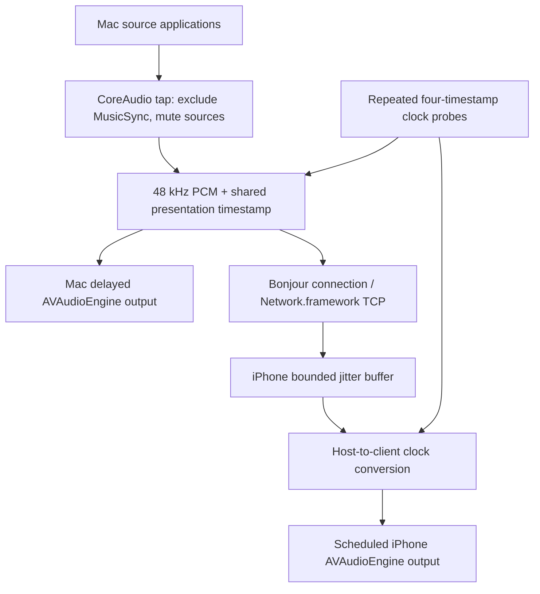

# MusicSync

MusicSync streams Mac system audio directly to an iPhone on the same LAN and schedules both speakers against one presentation timeline. Swift / SwiftUI, Apple frameworks only, no cloud, no audio driver installation. Requires **macOS 26.0+ and iOS 26.0+**. The committed Xcode project opens directly; CI builds with Xcode 26.6 to catch accidental newer API use.

This is a functional first implementation, not a claim of measured ±3 ms acoustic synchronization. Compilation and protocol tests can be automated; permissions, process muting, physical speaker latency and long-run clock drift must also be tested on real devices.

## Repository

- `MusicSync.xcodeproj`: shared `MusicSyncMac` and `MusicSynciOS` schemes.
- `Shared/MusicSyncCore`: local Swift package; versioned framing, Network.framework peer transport, monotonic clock estimation, adaptive delay, bounded jitter queue and XCTest tests (including real loopback TCP ping/PCM transport).
- `macOS/MusicSyncMac`: Host, CoreAudio process tap and ScreenCaptureKit alternative.
- `iOS/MusicSynciOS`: Bonjour browsing, receiver, reconnection, clock probes and jitter buffer.
- `AppShared/PCMPlayer.swift`: AVAudioEngine / AVAudioPlayerNode scheduled playback.
- `scripts`: reproducible project generator, builds, artifact validation and packaging.
- `.github/workflows/build.yml`: tests and both application builds on push, PR and workflow_dispatch.

## Capture modes — why two?

**Synchronized (default):** A CoreAudio global stereo process tap excludes MusicSync's own process. A private, tap-only aggregate reads it. `mutedWhenTapped` suppresses the original source applications while the tap is being read; MusicSync renders delayed PCM on the existing default Mac output. The private capture aggregate is not made the default device. Stopping/destroying the reader restores normal source output. No virtual driver is installed. Select the Mac's built-in speakers yourself in System Settings.

**Monitor (ScreenCaptureKit):** Captures display-associated system audio at 48 kHz stereo, with `excludesCurrentProcessAudio = true`, so receiver replay is not captured. Screen video is not sent or stored. ScreenCaptureKit leaves the source sound playing immediately on the Mac and provides no API to delay that original output. Therefore this mode streams to iPhone but cannot synchronize the original Mac sound. It intentionally does not add a second delayed Mac copy, which would cause an echo.

CoreAudio is used for the synchronized mode because the original Mac sound has to be suppressed for delayed replay. It is not silently substituted for ScreenCaptureKit with a promise that ordinary capture can delay existing sound.



## Use

1. Install both applications. Connect Mac and iPhone to the same trusted Wi-Fi/LAN. Disable Wi-Fi client isolation, and permit MusicSync through the Mac firewall if prompted.
2. Choose Mac built-in speakers; keep iPhone on its speaker rather than Bluetooth/AirPlay/headphones.
3. On Mac, **Start Host**. On iPhone, **Find Nearby Macs**, allow Local Network permission, then select the advertised Mac. No IP entry is needed.
4. Wait for clock synchronization (at least eight valid samples, roughly a second). Choose **Test Tone** first: short pulses play against the shared timeline on both devices.
5. Choose **Start Streaming** on Mac and grant System Audio Recording permission. Play ordinary browser/local music. Source apps are muted only during synchronized tap reading and their audio is replayed with a delay.
6. Use iPhone timing trim (−30…+30 ms) to calibrate residual output latency. Positive trim makes iPhone later. Stop streaming to restore ordinary playback.
7. To exercise the ScreenCaptureKit alternative, stop streaming, choose Monitor, grant Screen & System Audio Recording permission, then start. This mode cannot align the original Mac speaker sound.

The client reconnects automatically to the selected Bonjour service after a connection fails. Explicit Disconnect disables retries. Route changes clear/restart the audio queue; interruptions pause playback and attempt restart when they end. Keep the client foreground for initial tests. The audio background mode permits ongoing playback, but discovery/reconnection while suspended is not guaranteed. Mac sleep, network changes and application termination are not seamless sessions.

## Permissions and signing

The apps explain Local Network and capture access before users start the corresponding operation. Both Info.plists declare `NSLocalNetworkUsageDescription` and `NSBonjourServices` (`_musicsync._tcp`). macOS declares `NSAudioCaptureUsageDescription` and a screen capture explanation. System Audio Recording / Screen & System Audio Recording is managed by macOS Privacy & Security. A denial may require changing System Settings and relaunching. Neither app records microphone input, so microphone permission is not requested.

The macOS application deliberately uses no App Sandbox entitlement: the global process tap/private aggregate path must be validated outside App Sandbox. Empty entitlements are committed for both apps. iOS uses a playback AVAudioSession and `UIBackgroundModes = audio`; no multicast entitlement is needed for NWBrowser Bonjour. Developer provisioning entitlements are added when you sign for device installation.

## Synchronization

Each device uses `mach_absolute_time()` converted with its timebase, rather than wall-clock dates. iPhone sends `t1`, Host receives at `t2` and responds at `t3`, iPhone receives at `t4`:

- `RTT = (t4 − t1) − (t3 − t2)`.
- `offset = ((t2 − t1) + (t3 − t4)) / 2` (Host clock minus iPhone clock).
- Keep the last 32 valid samples; average the eight with smallest RTT, then gently smooth the offset after startup. Reject invalid/nonfinite samples and RTT ≥ 1 second. Repeat every second after the initial fast probes.
- RTT variance estimates jitter. The UI's clock uncertainty is `RTT / 2 + jitter`, **not a measured acoustic synchronization error**. Asymmetric network paths and inaccurate output latency can add error.

The Host starts a continuous sample-count presentation timeline roughly **180 ms** after capture. Frames carry Host-domain PTS, sequence and stream epoch. Both outputs render for that same PTS. iPhone converts PTS with `localPTS = hostPTS − offset`, and each player subtracts its reported output latency from the acoustic target before scheduling `AVAudioPlayerNode` with an `AVAudioTime` host time.

iPhone buffers/reorders packets, drops duplicate/late/invalid frames, bounds the queue to 100 frames, and schedules within a short future window. Late frames request a larger common delay. The Host combines receiver requests with RTT/jitter margin and raises the shared delay within **180–500 ms**. It never reduces delay midstream, avoiding overlap with already scheduled frames. Stop/start resets the delay. Multiple clients share the largest delay requirement. Raising delay or recovering after a stall can create an audible gap; a late frame is dropped instead of played immediately at the wrong time.

Expected total delay on a healthy LAN is around **180–250 ms**, plus capture/conversion overhead; the upper buffer limit is 500 ms under poor conditions. These are design budgets, not hardware measurements. Relative speaker timing depends on device latency reporting, Wi-Fi asymmetry, timing trim and acoustic distance (about 3 ms per metre). Periodic clock correction limits clock drift, but there is no continuously variable resampler/PLL yet; long sessions may show small gaps/overlaps as clocks and audio hardware drift. Exact or sample-accurate acoustic alignment is not guaranteed.

## Network protocol v1

One Bonjour-advertised TCP connection per receiver. Network.framework, TCP_NODELAY, no internet server. Each message is a 4-byte unsigned **big-endian byte length**, followed by a UTF-8 Codable JSON object, maximum 128 KiB. PCM `Data` is JSON base64. This intentionally trades modest bandwidth/encoding overhead for inspectable, stable initial framing.

Kinds: `hello`, `ping`, `pong`, `stats`, `timeline`, `audio`, `stop`. The version is checked. Audio contains `sequence`, `epoch`, `pts`, `sampleRate` (48000), `channels` (2), `frames` (normally 480 / 10 ms), `latency`, and `payload`. Payload is interleaved stereo **little-endian Float32 PCM**; its exact byte size is validated. Native capture formats are converted to this format with AVAudioConverter.

Raw PCM is 3.072 Mbit/s per receiver; base64 plus JSON is roughly 4.3 Mbit/s. TCP provides reliable ordering but head-of-line blocking can increase delay during packet loss. Outbound queues are bounded to 512 KiB; a stalled peer is disconnected rather than accumulating stale audio. v1 has **no encryption or authentication**, so use a trusted LAN. The host accepts LAN connections while Host is active. Pairing/TLS and UDP or QUIC are future improvements.

## Build

Open `MusicSync.xcodeproj` in Xcode 26 or later. Select `MusicSyncMac` or `MusicSynciOS`. To install directly on iPhone, choose your signing team/bundle identifier and an actual device. Apple Developer certificates are not required for CI compilation.

```sh
swift test --package-path Shared/MusicSyncCore
bash scripts/build.sh
```

`python3 scripts/generate_project.py` regenerates the committed project and Info.plists deterministically, with no third-party generator. If adding Swift files, run it again. Runtime dependencies use Apple frameworks only.

## GitHub Actions artifacts

Open **Actions → Build MusicSync → successful run → Artifacts**:

| Artifact | Contents |
| --- | --- |
| `MusicSync-iOS` | `MusicSync-iOS.ipa`, `MusicSync-iOS.app.zip` (contains `MusicSync-iOS.app`) |
| `MusicSync-macOS` | `MusicSync-macOS.zip` (contains universal `MusicSync-macOS.app`) |
| `MusicSync-build-logs` | xcodebuild logs |

The workflow uses macos-26 and Xcode 26.6, checks that project generation causes no diff, runs protocol tests, then builds with `CODE_SIGNING_ALLOWED=NO` / `CODE_SIGNING_REQUIRED=NO`. The iOS IPA contains `Payload/MusicSync.app`, no developer signature or provisioning profile. It **must be signed/provisioned** with a suitable sideloading tool or rebuilt with Xcode signing before a normal iPhone can install/run it. An unsigned IPA is not directly installable.

Mac packaging applies an ad-hoc signature (no certificate), verifies it, and preserves bundle permissions using ditto. It is not Developer ID signed or notarized; macOS may require an explicit Open / Allow Anyway decision for a downloaded app. CI does not launch apps or grant capture permissions on the runner. Packaging verifies executable presence, minimum OS, IPA layout and Mac signature.

## Known limitations / hardware validation still needed

- DRM/protected media and apps excluded by platform policy may yield silence or refuse capture. This does not bypass DRM. Test a local nonprotected audio file and ordinary browser audio first.
- CoreAudio process muting, own-process exclusion and aggregate behavior need real-device validation across source apps. If tap start fails, the app cleans up the reader, aggregate and tap; errors appear in the UI.
- No calibrated ±3 ms result is claimed. CI cannot measure physical speakers or permissions. Use the test pulse and record both speakers on one microphone to measure relative timing.
- Timing trim is manual. Per-device persistent calibration, hardware drift resampling, authenticated pairing, packet-loss concealment and graceful sleep recovery are pending.
- LAN congestion, client isolation, VPN/firewall filtering, Bluetooth/AirPlay routes and UI/main-runloop stalls can cause drops. JSON PCM conversion and scheduling are a first implementation, not a real-time lock-free audio pipeline.
- Source applications' transport/video remains undelayed; synchronized speaker replay adds an audio/video offset to video content. This app is aimed primarily at music.
