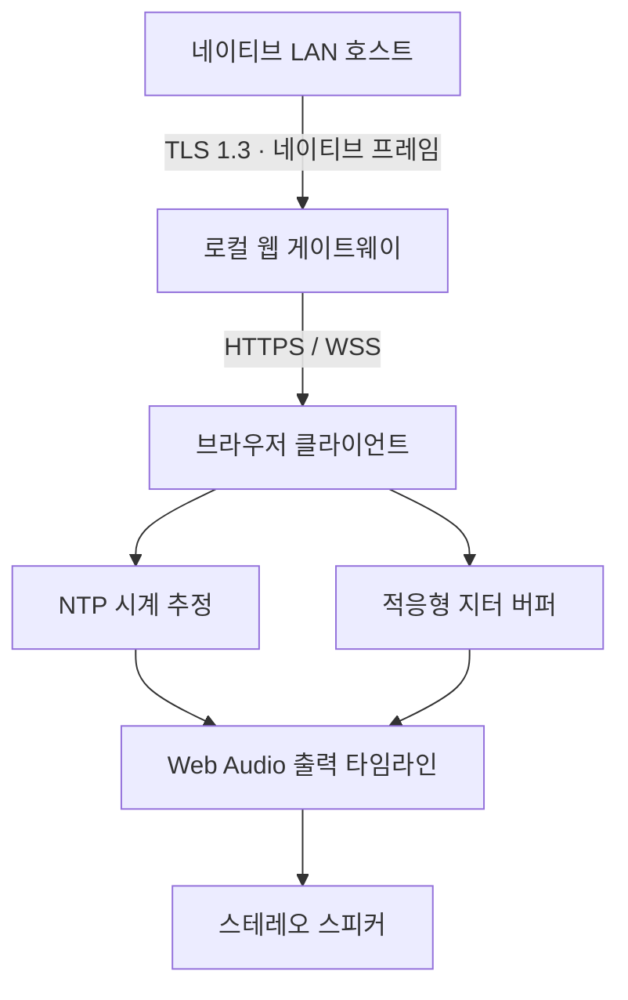

# MusicSync 웹 0.10.0

기존 Mac·iPhone·Windows·Linux·Android 호스트에 연결하는 실제 **브라우저 클라이언트**입니다. LAN 검색, 코드 비교와 호스트 승인, 암호화, 예약 스테레오 PCM 재생, 적응형 버퍼, 한·영 UI, 채널 선택·식별음·권한 기반 기기 제어를 지원합니다. MIT 라이선스이며 외부 폰트·분석 서비스·오디오 클라우드를 사용하지 않습니다.

[English](README.md) · [GitHub](https://github.com/ACOPS1206/MusicSync)

## 실행

같은 LAN의 Mac·Windows·Linux 컴퓨터에 Node.js 22 이상과 OpenSSL을 설치하세요. Windows에서는 Git for Windows의 OpenSSL `usr/bin`을 PATH에 추가할 수 있습니다.

```sh
cd web
npm ci
npm run setup
npm start
```

게이트웨이 터미널에 표시된 **초대 URL**을 브라우저에서 엽니다. 네이티브 MusicSync 호스트를 켜면 게이트웨이가 Bonjour로 자동 검색합니다. 호스트 IP 직접 입력은 필요 없지만, 게이트웨이 페이지 자체는 표시된 URL로 열어야 합니다. 초대 링크는 신뢰하는 본인 기기에만 공유하세요. 게이트웨이 재시작마다 바뀝니다. 최대 8개 브라우저를 연결할 수 있으며, 사설 LAN 방화벽에서 HTTPS TCP 8443과 mDNS UDP 5353을 허용하세요. 공유기 포트 포워딩은 하지 마세요.

1. 아래 안내에 따라 개인 LAN 인증서를 신뢰합니다.
2. 초대 URL에서 호스트를 선택하고 **연결**을 눌러 오디오를 활성화합니다.
3. 호스트와 8자리 코드가 같은지 비교하고 **코드가 일치합니다**를 누른 다음, 호스트에서 이 기기를 승인합니다.
4. 호스트에서 스트리밍을 시작합니다. 휴대폰 잠금을 풀고 브라우저 탭을 보이는 상태로 유지합니다.
5. 자동·스테레오·왼쪽·오른쪽을 지정할 수 있습니다. 네이티브 호스트에서도 웹 기기의 채널 변경과 식별음 재생이 가능합니다. 호스트/다른 클라이언트 볼륨과 기기 제어는 기존 호스트 권한을 따릅니다. 웹 볼륨은 브라우저 제한으로 **시스템 볼륨이 아닌 앱 볼륨**입니다.

`PORT`(기본 8443), `MUSICSYNC_WEB_BIND`(기본 `0.0.0.0`), `MUSICSYNC_WEB_DATA`(기본 현재 폴더의 `.local`)로 설정합니다. 데이터 폴더에 호스트 개인 키이 있으므로 보호하세요. 게이트웨이 페어링은 메모리에만 유지하며 게이트웨이 재시작이나 브라우저 새로고침 후 재승인해야 합니다. 기존 `pairings.json`은 시작 시 삭제합니다. 신뢰 오류를 우회하려고 키를 자동 교체하지 않습니다.

## HTTPS 인증서

안정적인 Web Audio와 WSS에는 신뢰된 HTTPS가 필요합니다. `npm run setup`은 localhost·현재 컴퓨터 이름·LAN IPv4 주소를 포함한 서버 인증서와 **개인 CA**를 생성합니다. 기존 키는 덮어쓰지 않습니다. 본인 기기에 **`.local/MusicSync-Web-CA.crt`만** 설치하고, 이 게이트웨이에서 가져온 파일인지 확인하세요. `ca.key`, `server.key`은 공유하면 안 됩니다. 브라우저 보안을 끄거나 인증서 검증을 비활성화하지 마세요. CA를 신뢰하면 그 CA에 TLS 신뢰 권한이 생기므로 컴퓨터를 보호하고 사용 종료 시 기기에서 제거하세요.

- macOS: 키체인 접근으로 CA를 가져와 SSL 신뢰를 지정합니다.
- iOS/iPadOS: AirDrop/파일로 CA를 가져와 설정에서 프로파일을 설치한 뒤, **일반 → 정보 → 인증서 신뢰 설정**에서 전체 신뢰를 활성화합니다. 인증서 경고만 넘기면 Safari 보안 API가 안정적으로 동작하지 않을 수 있습니다. 웹 수신에는 마이크·화면 녹화 권한이 필요 없습니다.
- Windows: 현재 사용자 신뢰할 수 있는 루트 인증 기관에 가져옵니다.
- Android: 보안 자격 증명에서 CA 인증서로 설치합니다. 브라우저/제조사 및 관리 정책에 따라 지원이 다를 수 있습니다.
- Linux/Firefox: 해당 브라우저 인증 기관 또는 브라우저가 사용하는 OS 저장소에 가져옵니다.

필요 시 터미널의 서버 인증서 SHA256 지문과 비교하세요. DHCP로 IP가 변경되면 SAN이 맞지 않을 수 있으므로 인증서에 포함된 호스트 이름을 사용하거나 기존 CA로 새 주소를 포함한 서버 인증서를 발급하세요. 생성된 서버 인증서는 1년 후 만료됩니다. 관리형 LAN의 신뢰된 `server.crt`/`server.key`를 데이터 폴더에 넣을 수도 있습니다. 평문 오디오 폴백은 없습니다.

## 연결·동기화 원리



게이트웨이는 두 TLS 연결을 종료하는 신뢰된 LAN 브리지입니다. **브라우저↔호스트 종단 간 암호화는 아닙니다.** 브라우저에 TLS exporter API가 없으므로 게이트웨이가 네이티브 v2 exporter 코드, HMAC 증명, P-256 공개 키 고정을 대신 처리합니다. 기존 네이티브 호스트 인증은 변경하지 않습니다. 처음에는 코드 비교와 호스트 승인이 필요하고, 기억한 키가 바뀌면 연결을 거절합니다. 비밀은 브라우저 메시지나 로그에 전달하지 않습니다. 초대로 Secure·HttpOnly·SameSite 쿠키를 설정하며 WSS는 세션과 정확한 Origin을 검사합니다. 임의 주소로 TCP 연결을 열 수 없고 검색된 호스트만 선택할 수 있습니다. 메시지 크기·전송 대기량·기기 수에 상한이 있습니다.

각 브라우저는 별도의 기기 ID와 네이티브 TLS 연결로 페어링합니다. 브라우저 ping/pong 시각을 그대로 전달하므로 NTP 왕복에는 게이트웨이 경로도 포함됩니다. 최근 32개 중 RTT가 낮은 8개를 평균합니다. 호스트 재생 시각을 브라우저 단조 시계로 변환하고, 가능한 경우 `AudioContext.getOutputTimestamp()`로 실제 출력 타임라인에 맞춥니다. 폴백은 추정 출력 지연을 보정합니다. 48 kHz 스테레오 Float32 LE PCM은 기기당 원시 약 384 kB/s, JSON/Base64 포함 약 512 kB/s입니다.

늦거나 중복·이전 epoch인 패킷은 버립니다. 수신 즉시 재생하지 않고 미리 예약합니다. 폐기가 늘면 공통 호스트 버퍼를 180 ms에서 최대 500 ms까지 요청하고, 출력 지연이 큰 기기는 더 일찍 예약합니다. 수동 출력 보정은 ±30 ms입니다. 동기화/새 오디오 epoch 시작 후 **30초**가 지나고, 시계 불확실성 >60 ms·예약 지연 >25 ms·스트림 중 2초 이상 오디오 부재가 **5초 지속**되어야 경고합니다. RTT·오프셋·지터·버퍼·불확실성·예약 지연·출력 지연 추정·큐 길이·폐기·준비 시간·채널은 실시간 현황 하단에 표시됩니다. 실제 스피커 간 음향 오차 측정값은 아닙니다.

## 검증·Actions 배포

```sh
npm test
npx playwright install chromium
npm run test:browser
```

`.github/workflows/web.yml`은 단위 테스트와 실제 Chromium의 HTTPS→WSS→네이티브 TLS→PCM 예약 재생을 검사합니다. macOS에서는 실제 Swift `MusicSyncCore` 호스트와도 검사합니다. **테스트 전용 호스트만** 자동 승인하며, 운영 게이트웨이는 승인을 우회하지 않습니다. 승인 전 오디오 차단, exporter/HMAC, 시계 추정, PCM·채널·한영 UI, 기억한 페어링 및 변경된 키 거절을 검증합니다.

GitHub **Actions → Build MusicSync web → 성공한 실행 → Artifacts → MusicSync-Web**을 받으세요. `MusicSync-Web.zip`에 게이트웨이, 웹 파일, 운영 npm 의존성, MIT 라이선스와 한영 문서가 포함됩니다. 압축을 풀고 Node.js 22+/OpenSSL 설치 후 해당 폴더에서 `npm run setup`, `npm start`를 실행하세요. 인증서·비밀·초대 링크는 로컬에서 생성되어 배포 파일에는 들어가지 않습니다. `MusicSync-Web-tests`에는 테스트 화면이 포함됩니다. 기존 네이티브 앱 artifact는 별도입니다.

## 현재 제한

- 첫 웹 버전은 **수신 클라이언트**입니다. 순수 브라우저는 Bonjour 광고나 네이티브 TCP 수신을 할 수 없으며, 웹 파일/시스템 오디오 호스팅은 구현하지 않았습니다.
- iOS/Safari 백그라운드·화면 잠금·절전·Bluetooth 출력 변경 시 중단될 수 있습니다. 연결 버튼으로 재개하세요. 웹 페이지에는 네이티브 Dynamic Island/Live Activity 및 보장된 백그라운드 재생이 없습니다. CI는 데스크톱 Chromium을 검증하며 Safari/Firefox/모바일의 실제 음향 검증은 필요합니다.
- 양호한 LAN 설계 지연은 약 180–300 ms, 상황에 따라 최대 500 ms입니다. 브라우저 메인 스레드와 Wi-Fi 비대칭 지연으로 오차가 생길 수 있으며 ±3 ms를 보장하지 않습니다. Bluetooth 대신 내장/유선 출력을 권장합니다.
- 호스트의 동기화 프로세스 탭/파일 재생은 지연 정렬을 지원합니다. ScreenCaptureKit 폴백과 Windows/Linux/Android 모니터 캡처는 원본 호스트 소리를 지연시키지 않아 먼저 들립니다. DRM 및 캡처 제한은 호스트에 그대로 적용됩니다.
- 예약 큐는 AudioWorklet이 아닌 제한된 메인 스레드 큐입니다. 무거운 작업이나 탭 제한 시 끊길 수 있습니다. 탭 복귀 때 큐/시계를 초기화하고 다시 동기화합니다.
- 게이트웨이 비밀은 하드웨어 키체인 대신 OS 파일 권한으로 보호합니다. 초대 보유자는 네이티브 페어링을 요청할 수 있으므로 신뢰하는 기기에만 공유하고 인터넷에 노출하지 마세요.

의존성: `ws`·`bonjour-service`는 MIT, Playwright는 테스트 전용 Apache-2.0입니다. 전이 의존성의 라이선스는 `node_modules`에 보존됩니다. MusicSync는 MIT이며 재배포 시 저작권/라이선스 고지를 유지하세요.

같은 브라우저 프로필은 한 탭에서만 연결할 수 있습니다. 독립 클라이언트가 더 필요하면 다른 브라우저 프로필을 사용하세요. 같은 기기 ID가 서로 연결을 교체하는 재연결 루프를 방지합니다. 페어링 완료 후 네이티브 연결이 끊기면 자동 재연결하며, 최초 연결 실패는 재시도 3회로 제한합니다.

## 실행 세션 한정 페어링

페어링은 현재 실행 세션에만 유효합니다. 비밀·호스트 공개키 고정·기기 제어 권한은 메모리에만 보관하며 앱 재시작 후 기억하지 않습니다. 기존 저장 기록은 새 버전 첫 실행 시 삭제합니다. 어느 한쪽 앱을 재시작하면 8자리 코드를 다시 비교하고 호스트에서 승인해야 합니다. 같은 실행 세션의 자동 재연결은 TLS 연결에 묶인 인증과 공개키 고정을 유지하며, 세션 도중 키가 바뀌면 기존 페어링을 명시적으로 지워야 합니다. 호스트 TLS 인증서는 별도로 유지합니다. 인증서가 사라졌다면 클라이언트를 재시작한 뒤 다시 승인할 수 있습니다. TLS 암호화는 항상 유지됩니다.
