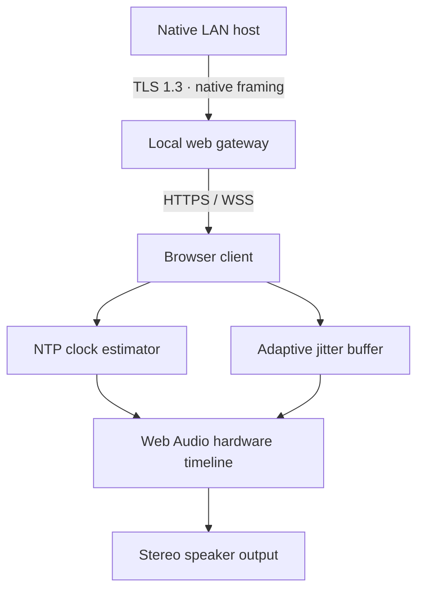

# MusicSync Web 0.10.0

A real browser **client** for existing MusicSync Mac, iPhone, Windows, Linux and Android hosts. It uses scheduled stereo PCM playback, host approval, automatic LAN host discovery through a local gateway, adaptive buffering, Korean/English UI, device channel selection, identification sounds and permission-gated host/peer controls. MIT licensed; no external fonts, analytics or streaming servers.

[한국어](README.ko.md) · [MusicSync](https://github.com/ACOPS1206/MusicSync)

## Run on your LAN

Install Node.js 22+ and OpenSSL on a Mac, Windows or Linux computer on the same network. Windows users can use OpenSSL supplied with Git for Windows (add its `usr/bin` to PATH). The gateway does not require Java, Swift, Docker or an Internet server.

```sh
cd web
npm ci
npm run setup
npm start
```

Start the native MusicSync host. Open the **invitation URL printed in the gateway terminal** in each browser. The gateway discovers `_musicsync._tcp` hosts via Bonjour/mDNS and presents a list; no native host IP entry is needed. The gateway itself currently requires opening its printed URL. Share the invitation only with your own trusted devices. It changes on each gateway restart. Up to eight browser connections are supported. Allow HTTPS port 8443 and mDNS UDP 5353 on private LAN firewalls; no router port forwarding.

1. Trust your private LAN web CA as explained below.
2. Open the invitation URL. Choose a discovered host and tap **Connect** to enable audio.
3. Compare the eight-digit code with the native host, tap **Codes match**, then approve the browser device on the host.
4. Start streaming on the host. Keep the browser tab visible and the phone unlocked.
5. Choose Automatic / Stereo / Left / Right. Native hosts see each browser as a separate approved client, can set its channel and identify it. Host/peer volume and device control follow native host permissions. Web volume changes **app gain**, because browsers cannot change system speaker volume.

`PORT` (default 8443), `MUSICSYNC_WEB_BIND` (default `0.0.0.0`) and `MUSICSYNC_WEB_DATA` (default `.local` relative to current working directory) configure the gateway. Keep that data directory private; it contains private keys and pairing secrets. Gateway pairings remain only in memory; restarting the gateway or reloading the browser requires reapproval. Legacy `pairings.json` is removed on startup. Do not delete/recreate keys just to work around a trust error.

## HTTPS certificate trust

Web Audio and encrypted WebSockets require a trusted HTTPS origin for reliable cross-device use. `npm run setup` generates a **private CA** and a server certificate covering localhost, this computer's current hostname and LAN IPv4 addresses. It never replaces existing keys. Install **only `.local/MusicSync-Web-CA.crt`** on your own devices, verifying that the file came from this gateway computer. Never share `ca.key`, `server.key`, or `pairings.json`. Do not disable browser security or certificate checking. Trusting this CA grants it TLS trust on that device, so secure the gateway computer and remove the CA when no longer using it.

- macOS: import the CA into Keychain Access and explicitly trust it for SSL.
- iOS/iPadOS: transfer the CA via AirDrop/Files, install its profile in Settings, then enable it in **General → About → Certificate Trust Settings**. A certificate warning bypass alone is insufficient for reliable Safari secure-context APIs. No microphone or screen recording permission is needed by this client.
- Windows: import into your user's Trusted Root Certification Authorities.
- Android: install as a CA certificate in security credentials settings. Browser/vendor support varies; enterprise restrictions can block user CAs.
- Linux/Firefox: import into browser Authorities or the OS trust store used by your browser.

Verify the leaf certificate SHA256 fingerprint against the gateway terminal if prompted. DHCP address changes can invalidate IP SANs; prefer a hostname listed in the certificate or issue a new server certificate under the existing private CA with the new SAN. Generated leaf certificates expire after one year. For a managed LAN, you can instead place your own trusted `server.crt` and `server.key` in the data directory. There is no HTTP/plaintext audio fallback.

## Transport and synchronization



The gateway terminates two TLS connections; it is a trusted LAN bridge, **not end-to-end browser-to-host encryption**. The browser has no TLS exporter API, so the gateway independently computes the native v2 TLS-exporter code and handles HMAC proof and P-256 key pinning on its behalf. Existing native host authentication is unchanged. Initial approval still requires code comparison and host approval; remembered host key changes fail closed. Secrets never appear in browser messages or logs. The invitation establishes a Secure, HttpOnly, SameSite cookie; WebSocket access checks the session and exact origin. Native connections cannot be opened to arbitrary addresses: only discovered hosts are selectable. Browser traffic/frame sizes and buffered bytes are bounded. The gateway keeps no cloud account or Internet audio connection.

Each browser is independently paired and uses its own device identity and native TLS connection. Browser ping/pong timestamps are forwarded unchanged, so four-timestamp NTP includes both gateway hops. The estimator averages the eight lowest RTTs from 32 samples. Playback uses host presentation timestamps converted to browser monotonic time, then to `AudioContext.getOutputTimestamp()` where available; fallback subtracts estimated output latency. Float32 little-endian PCM is 48 kHz stereo (~384 kB/s raw per client, ~512 kB/s with JSON/Base64). The queue rejects old epochs, late packets and duplicates; output is scheduled ahead rather than played immediately on receipt. Late packets increase requested common host latency, starting at 180 ms and capped at 500 ms. Route-aware scheduling looks further ahead for high output-latency devices. Manual trim is ±30 ms.

Warnings start after 30 seconds of synchronization/audio epoch warm-up and require a sustained five-second condition (clock uncertainty >60 ms, scheduling lateness >25 ms, or no audio for >2 seconds during a stream). Detailed RTT, offset, jitter, buffer latency, uncertainty, schedule lateness, output-latency estimate, queue length, drops, warm-up and stereo preset appear below live status. These are estimates, not acoustic measurements.

## Validation / artifact

```sh
npm test
npx playwright install chromium
npm run test:browser
```

`.github/workflows/web.yml` runs unit tests plus an actual headless Chromium HTTPS/WSS/native-TLS/PCM integration with an isolated test host. It also tests against the real Swift `MusicSyncCore` TLS implementation on a macOS runner. Test-only hosts auto-approve; the production gateway never bypasses native host approval. Tests cover pre-approval isolation, exporter/HMAC compatibility, clock estimation, scheduled PCM stereo, channel changes, bilingual UI, remembered pairing and changed-key rejection.

From GitHub **Actions → Build MusicSync web → successful run → Artifacts**, download **MusicSync-Web**. Its `MusicSync-Web.zip` contains the gateway, browser assets, production npm dependencies, license and both READMEs. Extract, install Node.js 22+/OpenSSL, enter the extracted folder, run `npm run setup` and `npm start`. Private certificates, secrets and invitation tokens are generated locally and never packaged. Test reports/screenshots are a separate `MusicSync-Web-tests` artifact. The existing native app artifacts remain separate.

## Limits

- This version is a browser **receiver**. Pure browser hosts cannot advertise Bonjour or accept native TCP connections; web file/system-audio hosting is not implemented.
- Safari/iOS background suspension, screen locking, power saving and Bluetooth route changes can interrupt audio; resume with Connect. No native Dynamic Island/Live Activity or guaranteed background playback in a web page. Current desktop Chromium is CI tested; Safari/Firefox/mobile acoustic behavior needs device validation.
- Healthy LAN design latency is roughly 180–300 ms, sometimes up to 500 ms. Browser main-thread scheduling and Wi-Fi asymmetry can add error; no guaranteed ±3 ms acoustic synchronization. Avoid Bluetooth for the tightest alignment.
- Synchronized host process-tap/file replay can align outputs. ScreenCaptureKit fallback and Windows/Linux/Android monitor capture leave the original host audio undelayed, so that original speaker remains ahead. DRM/capture restrictions still apply to the native host.
- Audio scheduling runs on a bounded main-thread queue, not an AudioWorklet. Heavy UI, throttling or very short packet bursts can underrun. Resuming a visible tab resets clock/queue and requires fresh synchronization.
- Gateway pairing storage uses OS file permissions, not a hardware keychain; protect the computer/account. An invitation holder is trusted to request native pairings. Do not expose this gateway to the Internet.

Dependencies: `ws` (MIT), `bonjour-service` (MIT); transitive packages retain their licenses in `node_modules`. Playwright (Apache-2.0) is test-only. MusicSync source remains MIT, with copyright/license notices preserved when redistributed.

Only one tab per browser profile may connect at once; open a different browser profile for another independent client. This prevents duplicate device identities from repeatedly replacing each other. Native connection loss reconnects automatically after established pairing; initial failures are capped at three retries.

## Session-only pairing

Pairing is session-only: secrets, Host public-key pins and device permissions are kept in memory, never remembered after app restart. Existing persisted pairing records are removed on first launch of this version. Restarting either endpoint requires comparing the eight-digit code again and approving on the Host. Automatic reconnection within the same running session still uses TLS-bound proofs and a pinned key; a key change within that session requires explicitly forgetting the pairing. The Host TLS identity remains separately persistent; losing it is recoverable by restarting the Client and reapproving. TLS encryption is always required.
